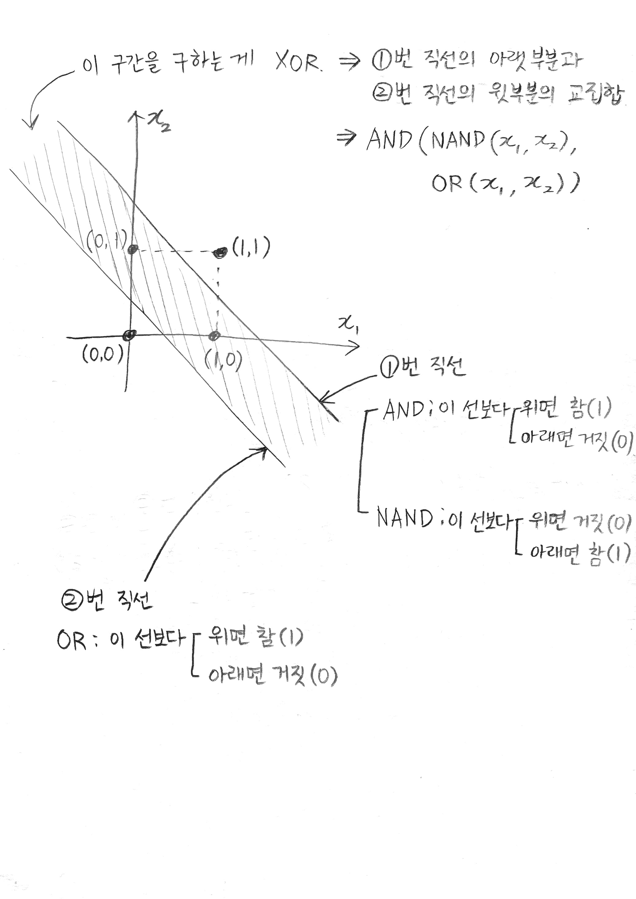

# 2. 퍼셉트론

---

## AND, NAND, OR, XOR

| x0, x1 | AND  | NAND | OR   | XOR  |
| ------ | ---- | ---- | ---- | ---- |
| 0, 0   | 0    | 1    | 0    | 0    |
| 0, 1   | 0    | 1    | 1    | 1    |
| 1, 0   | 0    | 1    | 1    | 1    |
| 1, 1   | 1    | 0    | 1    | 0    |

## XOR 정리

